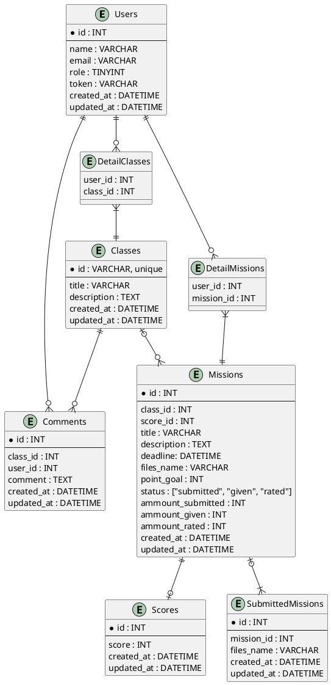

# Entity

- Users
- Comments
- Classes
- Scores
- Missions
- SubmittedMissions

\`

# Entity Relationchip Design

```plantuml
@startuml
    entity Users {
        *id : INT
        --
        name : VARCHAR
        email : VARCHAR
        role : TINYINT
        token : VARCHAR
        created_at : DATETIME
        updated_at : DATETIME
    }

    entity Comments {
        *id : INT
        --
        class_id : INT
        user_id : INT
        comment : TEXT
        created_at : DATETIME
        updated_at : DATETIME
    }

    entity Classes {
        *id : VARCHAR, unique
        --
        title : VARCHAR
        description : TEXT
        created_at : DATETIME
        updated_at : DATETIME
    }

    entity Scores {
        *id : INT
        --
        score : INT
        created_at : DATETIME
        updated_at : DATETIME
    }

    entity Missions {
        *id : INT
        --
        class_id : INT
        score_id : INT
        title : VARCHAR
        description : TEXT
        deadline: DATETIME
        files_name : VARCHAR
        point_goal : INT
        status : ["submitted", "given", "rated"]
        ammount_submitted : INT
        ammount_given : INT
        ammount_rated : INT
        created_at : DATETIME
        updated_at : DATETIME
    }

    entity SubmittedMissions {
        *id : INT
        --
        mission_id : INT
        files_name : VARCHAR
        created_at : DATETIME
        updated_at : DATETIME
    }

    entity DetailClasses {
        user_id : INT
        class_id : INT
    }

    entity DetailMissions {
        user_id : INT
        mission_id : INT
    }

    ' Table Users many to many Classes
    Users ||--o{ DetailClasses
    DetailClasses }|--|| Classes

    ' Classes one to many Comments
    Classes ||--o{ Comments

    ' Users one to many Comments
    Users ||--o{ Comments

    ' Classes one to many Missions
    Classes |o--o{ Missions

    ' Missions one to many SubmittedMissions
    Missions |o--|{ SubmittedMissions

    ' Users many to many Missions
    Users ||--o{ DetailMissions
    DetailMissions }|--|| Missions

    ' Missions one to one Scores
    Missions ||--o| Scores

@enduml
```
