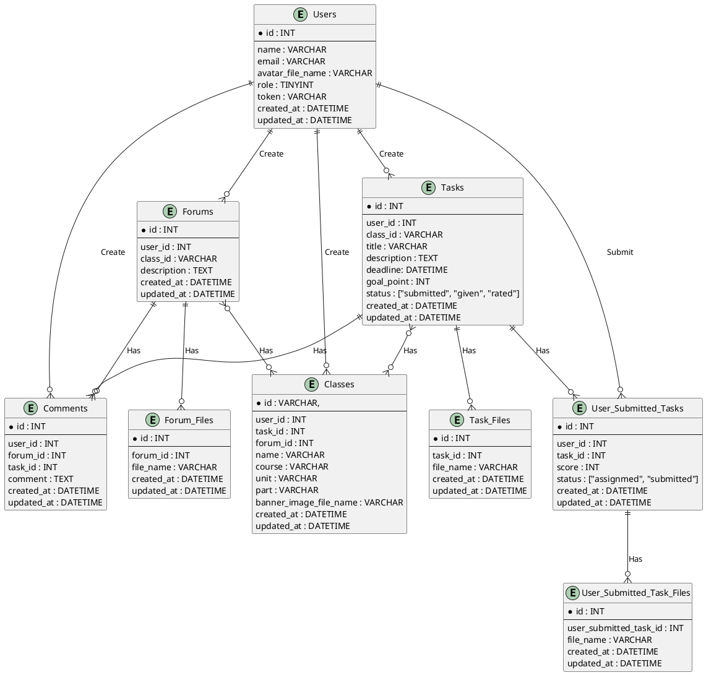

# Entity

- Users
- Comments
- Classes
- Forums
- Taks
- SubmittedTaks

\`

# Entity Relationchip Design

```plantuml
@startuml
    entity Users {
        *id : INT
        --
        name : VARCHAR
        email : VARCHAR
        avatar_file_name : VARCHAR
        role : TINYINT
        token : VARCHAR
        created_at : DATETIME
        updated_at : DATETIME
    }

    entity Comments {
        *id : INT
        --
        user_id : INT
        forum_id : INT
        task_id : INT      
        comment : TEXT
        created_at : DATETIME
        updated_at : DATETIME
    }

    entity Classes {
        *id : VARCHAR,
        --
        user_id : INT
        task_id : INT
        forum_id : INT
        name : VARCHAR
        course : VARCHAR
        unit : VARCHAR
        part : VARCHAR
        banner_image_file_name : VARCHAR
        created_at : DATETIME
        updated_at : DATETIME
    }

    entity Forums {
        *id : INT
        --
        user_id : INT
        class_id : VARCHAR
        description : TEXT
        created_at : DATETIME
        updated_at : DATETIME
    }

    entity Forum_Files {
        *id : INT
        --
        forum_id : INT
        file_name : VARCHAR
        created_at : DATETIME
        updated_at : DATETIME
    }

    entity Tasks {
        *id : INT
        --
        user_id : INT
        class_id : VARCHAR
        title : VARCHAR
        description : TEXT
        deadline: DATETIME
        goal_point : INT
        status : ["submitted", "given", "rated"]
        created_at : DATETIME
        updated_at : DATETIME
    }

    entity Task_Files {
        *id : INT
        --
        task_id : INT
        file_name : VARCHAR
        created_at : DATETIME
        updated_at : DATETIME
    }

    entity User_Submitted_Tasks {
        *id : INT
        --
        user_id : INT
        task_id : INT
        score : INT
        status : ["assignmed", "submitted"]
        created_at : DATETIME
        updated_at : DATETIME
    }

    entity User_Submitted_Task_Files {
        *id : INT
        --
        user_submitted_task_id : INT
        file_name : VARCHAR
        created_at : DATETIME
        updated_at : DATETIME
    }

    Users ||--o{ Classes : Create
    Tasks }o--o{ Classes : Has
    Forums }o--o{ Classes : Has

    Users ||--o{ Forums : Create

    Users ||--o{ Comments : Create
    Forums ||--o{ Comments : Has
    Tasks ||--o{ Comments : Has

    Users ||--o{ Tasks : Create
    Users ||--o{ User_Submitted_Tasks : Submit
    Tasks ||--o{ User_Submitted_Tasks : Has

    Forums ||--o{ Forum_Files : Has
    Tasks ||--o{ Task_Files : Has
    User_Submitted_Tasks ||--o{ User_Submitted_Task_Files : Has

@enduml
```